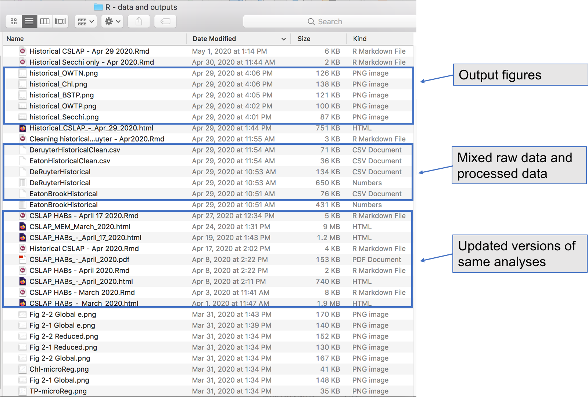
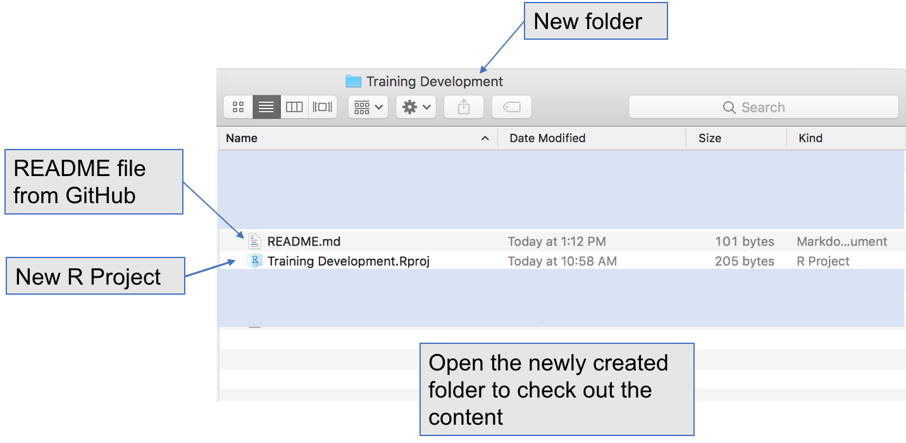

```{r setup, include=FALSE}
knitr::opts_chunk$set(echo = FALSE)
```

# Version Control with Git and GitHub

**Purpose** Synthesis of version control using Git, GitHub, and RStudio. This training document is meant to be distributed to graduate students and researchers who wish to optimize productivity by integrating version control into their workflow 

## Why version control?

- How do **you** keep track of your project history and versions?

### Hopefully, not like I did:

My root project folder


When we open up the catch-all folder, it's neither pretty nor organized



It's possible to get away with this workflow when you are only responsible for one or two projects at a time or you're not collaborating often, however; optimizing your workflow with version control will save you a lot of time, hassel, and the heartache of losing valuable code. 

## Version Control 

- This is the best way to organize and manage versions of your project 

- Think of version control as an unlimited 'undo' button


## Git and GitHub

**Git** is a *version control system* originally created for developers to collaborate on large software projects. Git tracks changes in the project over time so that there is always a comprehensive, structured record of the project. Each project is stored in a repository that includes all files that are part of the project.

**GitHub** has become the largest *hoster of Git repositories* and includes many useful features beyond the standard Git functions.This is the interface where you can easily collaborate and navigate changes made by you or collaborators.

## Getting Started 

You will need to create a [GitHub account](https://github.com/) and dowload [Git](https://git-scm.com/downloads)

## Check for Git in RStudio

- Open/re-start RStudio

- *File > New Project*. Is there an option to create from Version Control? 

- Select *New Directory > Empty Project.* Is there a "Create a git repository" option?

- Name your project. Look for the "Git" tab in the upper right pane

- If everything checks out, you can delete this project

## If you don't see that

- Open a new [shell](https://cfss.uchicago.edu/setup/shell/) 

- From RStudio: *Tools > Shell*

- Input

  - **Mac** `which git`
  
  - **Windows** `where git`
  
If Git is installed and findable, restart RStudio

From RStudio, go to *Tools > Global Options > Git/SVN* and make sure that the box *Git executable* points to the Git executable location
  
## Initialize new project 

- Overview

  - The basic workflow described here creates a project repository on GitHub

  - Then, you *clone*, or copy, that repository to your local computer

  - As you make *commits*, or changes, to the repository on your computer, you will then *push*, or upload, annotated changes to your GitHub repository

### Make a new repository on Github

- From homepage
  
  - *New Repository*
  
  - Check *initialize this repository with a README*
 
  - *Create Repository*
  
  - Copy the HTTPS close URL using *Clone or Download* 
  
  
### Initialize clone repository in RStudio 

- In RStudio 

  - *File > New Project > Version Control > Git*
  
  - In "repository URL", paste the URL that you just copied
  
  - Decide on your project pathway
  


### Recap

- We created a repository in GitHub. I like to picture this as a cloud or screen above me. It's always there, but I never work directly in it. 

- We used RStudio to clone the repository to our personal screens. I always work on my own screen, and then send these new versions to GitHub.

- By following these steps, we now have all these things simultaneously: 

  - A cloned Git repository that is linked to the GitHub repository
  
  - A new folder (directory) where everything related to our project will live 
  
  - A new RStudio Project (for more information on R projects, click [here](https://r4ds.had.co.nz/workflow-projects.html))
  


### Make your first commit (change) 

- In RStudio, we could open the `README.md`

  - Navigate to the File pane of RStudio and click **README.md** to open 
  
  - Add a line and write whatever you want

  - Save to your local workspace


### Commit and push to GitHub

- Now that you've saved that change to your local computer, you need to commit it and push it to your GitHub repository

- Click the **Git** tab in the upper right pane. Based on the status, you can see the pending change to `README.md`

- Check "Staged"


- A new window pops up to show you the changes

- When writing a commit message, focus more on explaining WHY you made the change, not WHAT change you made

  - This isn't so important here, but plays a bigger role when you're collaborating or trying to keep track of your own analysis
  
  - The commit itself already shows HOW you changed the code, but the commit message tells you WHY
  


- Push the commit to GitHub 


  - in general you will push less often than you commit
  
- **Note**: especially when you are working with collaborators, you will want to 'Pull' from GitHub before you 'Push' to ensure you are working with the most updated version (e.g., if a collaborator made an addition to the script this morning, you should Pull it before you start your edits)

## Real-world example 

Okay, we know how to create a GitHub repository, clone it to our computers, make local changes, and send it all back up to GitHub.

Now, we're going to go through an example of a real workflow 

### Open a new scripting file

- Within the same project you just created, open a new scripting file 

  - I personally prefer to script in a markdown document (.Rmd)
  new doc
  
- Save the new file to your working directory (i.e., the new folder you created)

- Check that your new file is saved in the correct directory 


### Create new folders within your working directory

- You could ignore this step and keep all your scripts, data, and outputs in one folder, but that leaves you liable to make errors down the line 

- The best practice is to keep separate your raw data, processed data, output figures, output tables, and scripts

In your current directory, create a few new folders (you can either use your OS directory (e.g., Finder on Mac) or the lower right pane in RStudio)

- e.g., "data_raw", "data_processed", "output_images"

**Check**: what is the file pathway for each of these new folders? How is it related to your working directory?


### Reading in raw data

Let's say you've collected and digitized your data into a spreadsheet (raw data). You make sure it's in `.csv` file, name it "mydata-raw.csv" and save it in the newly created `data_raw` folder 

You're ready to read it into your RMarkdown document using `read.csv()`

You execute this code

  -`read.csv("mydata-raw.csv")`
  
and see the following error: 


Why can't we open this csv? The code structure is correct, the file name and type are correct

#### Where R looks for data

This error is common and can lead to a lot of frustration if you don't understand file pathways. 

Because our working directory is 

`"/Users/victoriafield/Library/Mobile Documents/com~apple~CloudDocs/Summer Work/Training Documents/Training Development"` 

that is the only place `read.csv()` will look for a file called `"mydata-raw.csv"`. Any folder enclosed within the working directory (e.g., "data-raw") is a locked door...until we give R the key 

#### Specifying the correct pathway


Because we identified the correct pathway (i.e., an additional folder within the working directory), RStudio can accurately read in the csv

#### Specifying the correct pathway (shortcut)

Typing the entire pathway can be tedious. Fortunately, there's a shortcut

`"."` acts as an abbreviation for the working directory path

`"/Users/victoriafield/Library/Mobile Documents/com~apple~CloudDocs/Summer Work/Training Documents/Training Development"` 

is equivalent to 

`"."`

Using the new shortcut: 


### Processing data and writing to separate folder

Similar to reading in data from our computer to RStudio, we also write out data from RStudio to our computer usually after we: 

- Clean raw data 

- Process raw data

- Generate new dataframe from a raw dataset 

Let's say we modify the dataframe in R to include an additional column:

  -`df$ratio <-  df$hindfoot_length/df$weight`
  
We want this modified dataframe to be available for use in future analyses, but we don't want to simply over-write our raw data file. We want to export this new dataframe as a csv and store it in a separate folder


